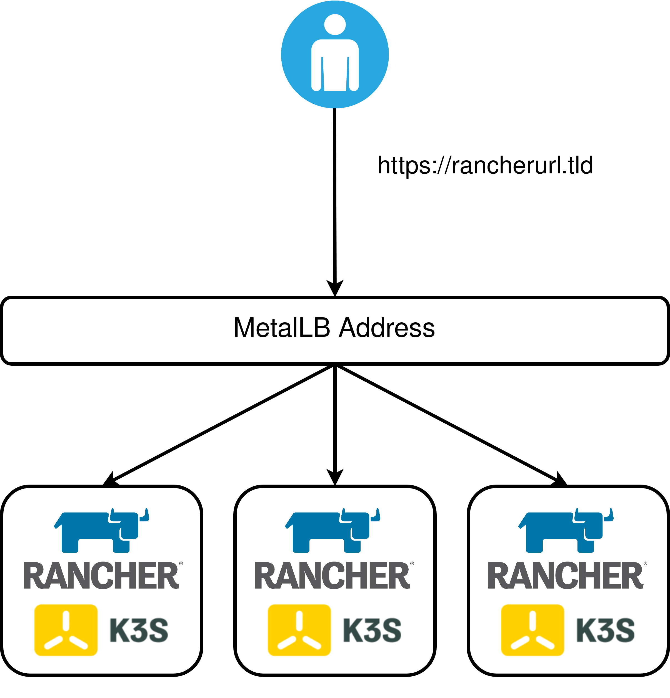

# vSphere-K3s-Rancher-Pulumi



This project creates a three node K3s cluster and installs the following components:

* Cert-Manager
* Rancher
* Metallb (for exposing the built-in Ingress)

This project leverages `cloud-init` as a bootstrap mechanism for installing K3s, and the subsequent components listed above. No direct SSH connectivity is required

# Prerequisites

* A VM template that has VMware guestinfo cloud-init integration - https://github.com/vmware/cloud-init-vmware-guestinfo. Or use the Packer template from https://github.com/David-VTUK/Rancher-Packer/tree/master/vSphere/ubuntu_2004_cloud_init_guestinfo

# Customising

* Rename `Pulumi.dev.yaml.example` to `Pulumi.dev.yaml`
* Populate respective to your environment
* Set the vSphere provider details: https://www.pulumi.com/docs/intro/cloud-providers/vsphere/setup/

Upon completion, Pulumi will output the DNS record that needs to be created:

```shell
Outputs:
    Rancher IP (Set DNS): "172.16.10.167"
    Rancher url:        : "rancher.virtualthoughts.co.uk"
```

It will take a few minutes, depending on performance and connection speed for Rancher to come online. You can grab the kubeconfig from the k3s nodes directly to validate.